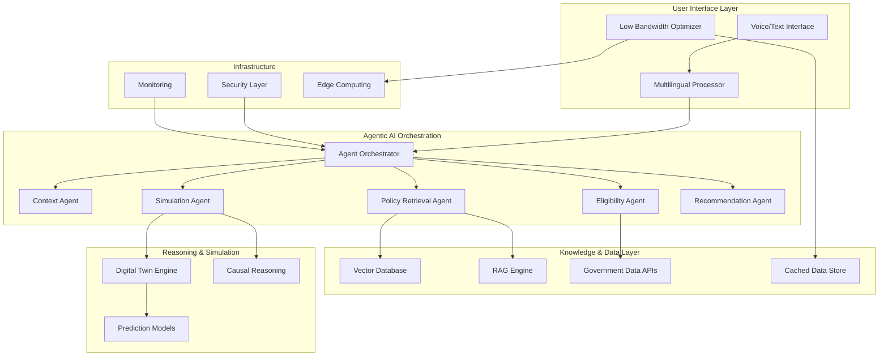

# Design Document: SamparkAI+

## Overview

SamparkAI+ is an agentic AI civic assistant designed to democratize access to government services for Indian citizens, particularly farmers and rural users. The system employs a multi-agent orchestration architecture where specialized AI agents collaborate to provide personalized, multilingual, voice-first assistance for discovering, evaluating, and applying for government schemes.

The core innovation lies in combining agentic AI orchestration with vector-based knowledge retrieval, digital twin simulation, and causal reasoning to deliver contextually aware, explainable recommendations that citizens can trust and act upon, even in low-bandwidth environments.

## Architecture

### High-Level Architecture



### Agent Orchestration Pattern

The system employs a **hierarchical orchestration pattern** with the Agent Orchestrator as the central coordinator. This pattern provides:

- **Centralized coordination** for complex multi-step workflows
- **Dynamic agent selection** based on query complexity and context
- **State management** across agent interactions
- **Fallback mechanisms** when agents fail or conflict

The orchestration follows a **planner-critic pattern** where the Context Agent acts as a planner, identifying user needs and creating execution plans, while other agents act as specialized critics and executors.

## Components and Interfaces

### 1. Voice Interface Component

**Purpose**: Handles speech-to-text (STT) and text-to-speech (TTS) processing with multilingual support.

**Key Interfaces**:
```typescript
interface VoiceInterface {
  processVoiceInput(audioData: AudioBuffer, language: string): Promise<TextInput>
  generateVoiceOutput(text: string, language: string): Promise<AudioBuffer>
  detectLanguage(audioData: AudioBuffer): Promise<string>
  optimizeForBandwidth(audioData: AudioBuffer): Promise<CompressedAudio>
}
```

**Implementation Approach**:
- AWS Transcribe for STT with custom vocabulary for government terms
- AWS Polly for TTS with Indian language support
- Local caching of common phrases for offline operation
- Audio compression algorithms for low-bandwidth transmission

### 2. Multilingual Processor

**Purpose**: Handles language detection, translation, and culturally appropriate response generation.

**Key Interfaces**:
```typescript
interface MultilingualProcessor {
  translateText(text: string, fromLang: string, toLang: string): Promise<string>
  detectLanguage(text: string): Promise<LanguageDetection>
  localizeContent(content: PolicyContent, targetLang: string): Promise<LocalizedContent>
  validateTranslation(original: string, translated: string): Promise<QualityScore>
}
```

**Implementation Approach**:
- AWS Translate for base translation with custom terminology
- Fine-tuned models for government domain terminology
- Cultural context adaptation for regional variations
- Confidence scoring for translation quality

### 3. Agent Orchestrator

**Purpose**: Central coordination hub that manages agent lifecycle, communication, and workflow execution.

**Key Interfaces**:
```typescript
interface AgentOrchestrator {
  processUserQuery(query: UserQuery): Promise<OrchestrationPlan>
  executeWorkflow(plan: OrchestrationPlan): Promise<WorkflowResult>
  coordinateAgents(agents: Agent[], context: ExecutionContext): Promise<AgentResults>
  resolveConflicts(conflictingResults: AgentResult[]): Promise<ResolvedResult>
  handleFailures(failedAgent: Agent, context: ExecutionContext): Promise<FallbackResult>
}
```

**Implementation Approach**:
- State machine-based workflow management
- Priority-based conflict resolution
- Circuit breaker pattern for agent failures
- Distributed tracing for debugging

### 4. Context Agent

**Purpose**: Understands user context, extracts relevant information, and maintains conversation state.

**Key Interfaces**:
```typescript
interface ContextAgent {
  extractUserContext(input: UserInput): Promise<UserContext>
  maintainConversationState(sessionId: string, newContext: UserContext): Promise<void>
  inferImplicitNeeds(context: UserContext): Promise<InferredNeeds>
  identifyMissingInformation(context: UserContext): Promise<MissingInfo[]>
}
```

**Implementation Approach**:
- Named Entity Recognition (NER) for extracting personal details
- Intent classification using fine-tuned BERT models
- Conversation memory using vector embeddings
- Rule-based inference for implicit needs

### 5. Policy Retrieval Agent

**Purpose**: Searches and retrieves relevant government policies using semantic search and RAG.

**Key Interfaces**:
```typescript
interface PolicyRetrievalAgent {
  searchPolicies(query: SemanticQuery): Promise<PolicyDocument[]>
  retrieveWithRAG(query: string, context: UserContext): Promise<EnrichedPolicyInfo>
  rankPoliciesByRelevance(policies: PolicyDocument[], context: UserContext): Promise<RankedPolicies>
  validatePolicyFreshness(policy: PolicyDocument): Promise<FreshnessStatus>
}
```

**Implementation Approach**:
- Vector embeddings using sentence-transformers
- Hybrid search combining semantic and keyword matching
- RAG pipeline with context-aware retrieval
- Automated policy freshness checking

### 6. Eligibility Agent

**Purpose**: Evaluates user eligibility for government schemes based on criteria and user context.

**Key Interfaces**:
```typescript
interface EligibilityAgent {
  evaluateEligibility(user: UserProfile, scheme: GovernmentScheme): Promise<EligibilityResult>
  identifyMissingRequirements(user: UserProfile, scheme: GovernmentScheme): Promise<MissingRequirement[]>
  rankSchemesByEligibility(schemes: GovernmentScheme[], user: UserProfile): Promise<RankedSchemes>
  suggestEligibilityImprovements(user: UserProfile, scheme: GovernmentScheme): Promise<ImprovementSuggestions>
}
```

**Implementation Approach**:
- Rule-based evaluation engine for explicit criteria
- ML models for fuzzy eligibility assessment
- Confidence scoring for uncertain evaluations
- Gap analysis for missing requirements

### 7. Simulation Agent

**Purpose**: Creates digital twins and performs outcome simulations using causal reasoning.

**Key Interfaces**:
```typescript
interface SimulationAgent {
  createDigitalTwin(user: UserProfile, scenario: PolicyScenario): Promise<DigitalTwin>
  simulateOutcomes(twin: DigitalTwin, interventions: PolicyIntervention[]): Promise<SimulationResults>
  performCausalAnalysis(outcomes: SimulationResults): Promise<CausalFactors>
  generateSensitivityAnalysis(twin: DigitalTwin, keyVariables: Variable[]): Promise<SensitivityResults>
}
```

**Implementation Approach**:
- Agent-based modeling for individual citizen simulation
- Causal inference using directed acyclic graphs (DAGs)
- Monte Carlo simulation for uncertainty quantification
- Counterfactual analysis for "what-if" scenarios

### 8. Recommendation Agent

**Purpose**: Generates personalized, actionable recommendations based on all available information.

**Key Interfaces**:
```typescript
interface RecommendationAgent {
  generateRecommendations(context: UserContext, eligibility: EligibilityResults, simulation: SimulationResults): Promise<PersonalizedRecommendations>
  prioritizeRecommendations(recommendations: Recommendation[], userPreferences: UserPreferences): Promise<PrioritizedRecommendations>
  createActionPlan(recommendation: Recommendation): Promise<StepByStepPlan>
  explainRecommendation(recommendation: Recommendation): Promise<ExplanationText>
}
```

**Implementation Approach**:
- Multi-criteria decision analysis (MCDA) for ranking
- Utility theory for preference modeling
- Natural language generation for explanations
- Adaptive learning from user feedback

## Data Models

### Core Data Structures

```typescript
// User and Context Models
interface UserProfile {
  id: string
  demographics: Demographics
  location: GeographicLocation
  occupation: Occupation
  financialStatus: FinancialProfile
  familyComposition: FamilyDetails
  preferences: UserPreferences
  conversationHistory: ConversationTurn[]
}

interface UserContext {
  currentQuery: string
  extractedEntities: NamedEntity[]
  inferredIntent: Intent
  conversationState: ConversationState
  urgencyLevel: UrgencyLevel
  confidenceScore: number
}

// Policy and Scheme Models
interface GovernmentScheme {
  id: string
  name: string
  description: string
  eligibilityCriteria: EligibilityCriterion[]
  benefits: Benefit[]
  applicationProcess: ApplicationStep[]
  documents: RequiredDocument[]
  deadlines: ImportantDate[]
  contactInfo: ContactInformation
  lastUpdated: Date
}

interface PolicyDocument {
  id: string
  title: string
  content: string
  embeddings: number[]
  metadata: PolicyMetadata
  relatedSchemes: string[]
  effectiveDate: Date
  expiryDate?: Date
}

// Simulation and Reasoning Models
interface DigitalTwin {
  userId: string
  baselineState: UserState
  simulationParameters: SimulationConfig
  historicalData: TimeSeriesData[]
  predictiveModels: ModelReference[]
  uncertaintyBounds: UncertaintyRange
}

interface SimulationResults {
  scenarioId: string
  predictedOutcomes: OutcomePrediction[]
  confidenceIntervals: ConfidenceInterval[]
  keyInfluencingFactors: CausalFactor[]
  riskAssessment: RiskProfile
  timeHorizon: TimeRange
}

// Agent Communication Models
interface AgentMessage {
  senderId: string
  receiverId: string
  messageType: MessageType
  payload: any
  timestamp: Date
  correlationId: string
}

interface WorkflowResult {
  workflowId: string
  status: WorkflowStatus
  results: AgentResult[]
  executionTime: number
  errors: WorkflowError[]
  recommendations: Recommendation[]
}
```

### Vector Database Schema

The vector database stores government policy documents and schemes as high-dimensional embeddings for semantic search:

```typescript
interface PolicyEmbedding {
  documentId: string
  embedding: number[] // 768-dimensional vector
  metadata: {
    title: string
    category: PolicyCategory
    targetAudience: string[]
    geographicScope: string[]
    lastUpdated: Date
    language: string
  }
  chunks: DocumentChunk[] // For large documents
}

interface DocumentChunk {
  chunkId: string
  content: string
  embedding: number[]
  position: number
  parentDocumentId: string
}
```

## Correctness Properties

*A property is a characteristic or behavior that should hold true across all valid executions of a system—essentially, a formal statement about what the system should do. Properties serve as the bridge between human-readable specifications and machine-verifiable correctness guarantees.*

Before defining the correctness properties, I need to analyze the acceptance criteria from the requirements to determine which ones can be tested as properties.

### Property 1: Voice Interface Processing Consistency
*For any* audio input in supported Indian languages, the Voice_Interface should convert speech to text with consistent accuracy, generate natural-sounding speech output, and handle unclear input by requesting clarification while filtering background noise.
**Validates: Requirements 1.1, 1.2, 1.3, 1.4, 1.5**

### Property 2: Multilingual Processing Accuracy
*For any* text input, the Multilingual_Processor should correctly detect language, maintain translation accuracy for government terminology, handle language switches mid-conversation, and indicate uncertainty when translation confidence is low.
**Validates: Requirements 2.1, 2.2, 2.3, 2.5**

### Property 3: Agent Orchestration Coordination
*For any* user query, the Agent_Orchestrator should analyze the query to select appropriate agents, coordinate multi-agent execution in optimal sequence, facilitate inter-agent communication, resolve conflicts using priority rules, and provide fallback responses on failure.
**Validates: Requirements 3.1, 3.2, 3.3, 3.4, 3.5**

### Property 4: Context Understanding Completeness
*For any* user input describing a situation, the Context_Agent should extract relevant information, ask clarifying questions for ambiguous intent, maintain conversation history across turns, infer implicit needs, and identify missing information.
**Validates: Requirements 4.1, 4.2, 4.3, 4.4, 4.5**

### Property 5: Policy Retrieval Semantic Consistency
*For any* policy query, the Policy_Retrieval_Agent should perform semantic search in the Vector_Database, combine retrieved documents with generated explanations via RAG, rank results by relevance, indicate outdated information, and suggest alternatives when no results are found.
**Validates: Requirements 5.1, 5.2, 5.3, 5.4, 5.5**

### Property 6: Eligibility Evaluation Completeness
*For any* user profile and government scheme combination, the Eligibility_Agent should evaluate against all criteria, identify missing requirements with fulfillment suggestions, rank multiple applicable schemes by approval likelihood and benefit, re-evaluate on criteria changes, and provide confidence scores for uncertain evaluations.
**Validates: Requirements 6.1, 6.2, 6.3, 6.4, 6.5**

### Property 7: Simulation Prediction Accuracy
*For any* user scenario requiring outcome prediction, the Simulation_Agent should create a digital twin model, predict outcomes including benefits and risks, identify influential causal factors, include confidence intervals and assumptions, and perform sensitivity analysis for uncertain results.
**Validates: Requirements 7.1, 7.2, 7.3, 7.4, 7.5**

### Property 8: Recommendation Personalization Consistency
*For any* recommendation generation request, the Recommendation_Agent should consider user context, eligibility, and predicted outcomes, prioritize based on preferences and constraints, provide step-by-step guidance, update recommendations when circumstances change, and track outcomes for improvement.
**Validates: Requirements 8.1, 8.2, 8.3, 8.4, 8.5**

### Property 9: Bandwidth Optimization Resilience
*For any* network condition, the Low_Bandwidth_Optimizer should compress data and prioritize essential information under limited bandwidth, cache critical information during intermittent connections, use efficient audio compression, provide offline functionality, and automatically sync when bandwidth improves.
**Validates: Requirements 9.1, 9.2, 9.3, 9.4, 9.5**

### Property 10: Government API Integration Reliability
*For any* government system interaction, the SamparkAI_Plus should authenticate securely with rate limiting, refresh knowledge base within 24 hours of data updates, use cached data with staleness notifications on API failures, ensure data integrity in application submissions, and provide manual guidance when direct integration is unavailable.
**Validates: Requirements 10.1, 10.2, 10.3, 10.4, 10.5**

### Property 11: AI Decision Explainability
*For any* AI-generated decision or recommendation, the SamparkAI_Plus should provide clear reasoning explanations, state which eligibility criteria were met or missed, explain key factors influencing simulation outcomes, provide detailed explanations for expectation conflicts, and offer appropriate detail levels without overwhelming users.
**Validates: Requirements 11.1, 11.2, 11.3, 11.4, 11.5**

### Property 12: Data Security and Privacy Protection
*For any* user data interaction, the SamparkAI_Plus should encrypt personal information in transit and at rest, anonymize conversation history with automatic deletion policies, obtain explicit consent for data sharing with logging, remove personal information within 30 days of deletion requests, and immediately notify users with containment measures during breaches.
**Validates: Requirements 12.1, 12.2, 12.3, 12.4, 12.5**

## Error Handling

### Error Categories and Strategies

**1. Voice Processing Errors**
- **Speech Recognition Failures**: Implement confidence thresholds and request re-recording for low-confidence transcriptions
- **Audio Quality Issues**: Apply noise reduction algorithms and provide feedback for better audio positioning
- **Language Detection Errors**: Use multiple detection models and allow manual language selection as fallback

**2. Agent Orchestration Errors**
- **Agent Timeout**: Implement circuit breaker pattern with exponential backoff and fallback to cached responses
- **Inter-Agent Communication Failures**: Use message queuing with retry mechanisms and dead letter queues
- **Workflow Execution Errors**: Maintain execution state and provide partial results with error explanations

**3. Knowledge Retrieval Errors**
- **Vector Database Unavailability**: Maintain local cache of frequently accessed policies with staleness indicators
- **RAG Generation Failures**: Fallback to template-based responses using retrieved documents only
- **Semantic Search Errors**: Implement hybrid search combining keyword and semantic approaches

**4. Simulation and Prediction Errors**
- **Digital Twin Creation Failures**: Use simplified models with reduced feature sets as fallback
- **Causal Inference Errors**: Provide uncertainty bounds and alternative scenario analyses
- **Prediction Model Failures**: Fallback to rule-based heuristics with confidence disclaimers

**5. Integration Errors**
- **Government API Failures**: Use cached data with clear staleness warnings and manual process guidance
- **Authentication Errors**: Implement token refresh mechanisms and secure credential management
- **Rate Limiting**: Implement exponential backoff and request queuing with user notifications

### Error Recovery Mechanisms

```typescript
interface ErrorRecoveryStrategy {
  detectError(error: SystemError): ErrorCategory
  selectRecoveryAction(category: ErrorCategory, context: ExecutionContext): RecoveryAction
  executeRecovery(action: RecoveryAction): Promise<RecoveryResult>
  logAndMonitor(error: SystemError, recovery: RecoveryResult): void
}
```

## Testing Strategy

### Dual Testing Approach

The testing strategy employs both unit testing and property-based testing to ensure comprehensive coverage:

**Unit Testing Focus:**
- Specific examples demonstrating correct behavior for each component
- Edge cases and error conditions (network failures, malformed input, API timeouts)
- Integration points between agents and external systems
- Security boundary testing (authentication, authorization, data encryption)

**Property-Based Testing Focus:**
- Universal properties that hold across all valid inputs (voice processing accuracy, multilingual consistency)
- Comprehensive input coverage through randomization (user profiles, policy documents, conversation flows)
- Invariant preservation (conversation state consistency, data integrity)
- Round-trip properties (voice-to-text-to-voice, translation accuracy)

### Property-Based Testing Configuration

**Framework Selection**: Use Hypothesis (Python) or fast-check (TypeScript) for property-based testing
**Test Configuration**: Minimum 100 iterations per property test to ensure statistical significance
**Test Tagging**: Each property test must reference its design document property using the format:
```
# Feature: sampark-ai-plus, Property 1: Voice Interface Processing Consistency
```

### Testing Environments

**1. Development Testing**
- Local testing with mock government APIs
- Synthetic voice data for multilingual testing
- Simulated network conditions for bandwidth optimization testing

**2. Integration Testing**
- Sandbox government API integration
- Real multilingual voice samples from target user groups
- Edge device testing for low-bandwidth scenarios

**3. Performance Testing**
- Load testing with concurrent user sessions
- Latency testing for voice processing pipeline
- Memory usage testing for offline operation modes

### Test Data Strategy

**Synthetic Data Generation**:
- Government policy documents in multiple Indian languages
- User profiles representing diverse rural and urban demographics
- Voice samples with varying accents and background noise levels
- Network condition simulations (bandwidth, latency, intermittency)

**Privacy-Preserving Testing**:
- Anonymized real user conversations for conversation flow testing
- Synthetic personal information for eligibility testing
- Encrypted test data for security testing

### Monitoring and Observability

**Real-time Monitoring**:
- Agent orchestration performance metrics
- Voice processing accuracy rates
- API integration success rates
- User satisfaction scores

**Alerting Strategy**:
- Critical: System unavailability, security breaches, data corruption
- Warning: Performance degradation, API rate limiting, low accuracy rates
- Info: Usage patterns, feature adoption, user feedback

The testing strategy ensures that SamparkAI+ maintains high reliability and user trust while operating in challenging rural connectivity environments and handling sensitive government service interactions.